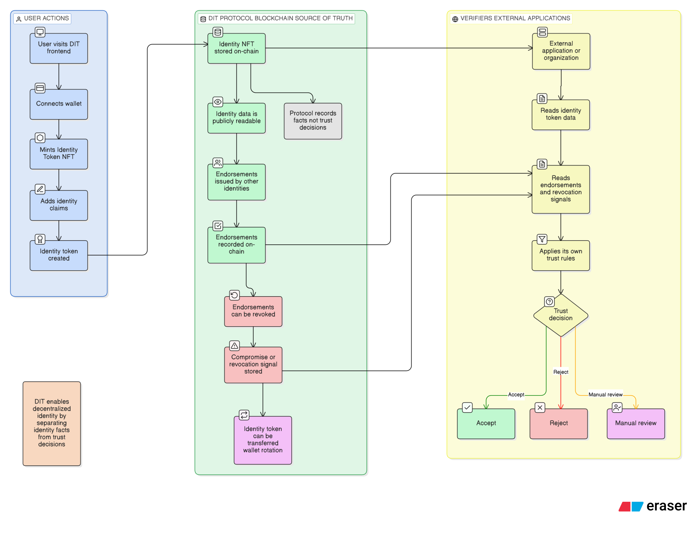

# Identity Tokens — Project Workflow

## Overview

- **Self-issued identity token minting:** Users create and mint their own identity tokens, optionally attaching metadata. No central issuer is required.

- **On-chain identity storage:** Identity tokens and their metadata are stored on-chain (e.g. as ERC-721 NFTs), providing a portable, verifiable record.

- **Endorsement by other identity holders:** Holders of identity tokens can endorse other identities on-chain, building a graph of attestations and trust.

- **Optional revocation:** Endorsements or credentials can support revocation (e.g. via a registry or expiry), so trust can be updated or withdrawn when needed.

- **Frontend reading on-chain data:** The frontend reads identity and endorsement data from the chain (e.g. via RPC and events) to display profiles, endorsements, and status.

- **External services verifying identity:** Third-party services can verify identity and endorsements by reading the same on-chain data, enabling use cases like access control or credential checks without relying on the frontend alone.

### 🔄 End-to-End System Workflow

To provide a clear understanding of the system flow (as requested in #91), here is the detailed interaction between the User, the Frontend, and the EVM Smart Contracts:

#### 1. Identity Initialization (User -> Frontend)
* **Wallet Connection:** The user connects via RainbowKit/Wagmi. The frontend checks the connected address for existing Identity Tokens.
* **Metadata Input:** If no token exists, the user provides identity metadata (name, handles, etc.) through the React-based forms.

#### 2. On-Chain Minting (Frontend -> Blockchain)
* **Transaction Trigger:** The frontend prepares a transaction call to the `IdentityToken` contract.
* **Signing:** The user signs the transaction via their wallet provider.
* **Recording:** The contract mints a new ERC-721 token representing the user's decentralized identity.

#### 3. Trust & Endorsements (Blockchain Source of Truth)
* **Peer Attestations:** Other identity holders can search for a specific token and trigger an `endorse` function.
* **Immutable Graph:** These endorsements build a web of trust directly on the blockchain, which the frontend fetches using RPC calls to display "Trust Scores" or "Verified Status."

#### 4. Verification & External Integration (Third-Party)
* **Data Retrieval:** External services or "Verifiers" can query the contract directly or through this frontend to confirm a user's identity claims without needing a central database.
